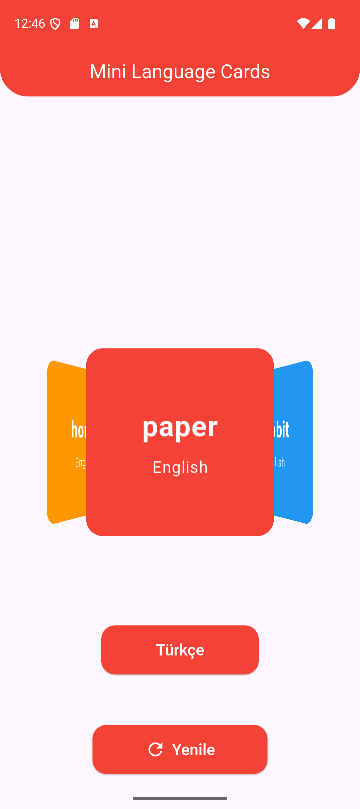

# 📘 Mini Language Cards

A simple **Flutter language flashcards app**.  
It shows 5 random words every day. Users can see the English word and its Turkish meaning.  

---

## 🚀 Features

- Displays **5 random words daily**  
- Avoids repeating yesterday’s words  
- Responsive and clean UI  
- State management with **Cubit**  
- Easy to add new words (`word_list.dart`)  

---

## 🛠️ Tech Stack

- **Flutter**  
- **Dart**  
- **flutter_bloc** (Cubit for state management)  
- **equatable** (for state comparison)  

---

## ⚙️ Installation

1. Clone the repo:  
   ```bash
   git clone https://github.com/username/minilanguagecards.git
   cd minilanguagecards
2. Install dependencies: 
   ```bash
   flutter pub get
3. Run the app:
   ```bash
   flutter run

   ## 📸 Screenshots

### 🏠 Home Screen

